<!--
author:   Samuel Jamet

email:    samuel.jamet.bib@proton.me

version:  0.0.1

language: fr

comment:  Try to write a short comment about
          your course, multiline is also okay.

link:     https://cdn.jsdelivr.net/chartist.js/latest/chartist.min.css

script:   https://cdn.jsdelivr.net/chartist.js/latest/chartist.min.js
-->

# LiaScript


## 🎶 Je lui dirai démo bleue...

<script
  style="display: block"
  modify="false"
>
"HTML: <marquee>Attention, tout ce qui suit a été réalisé sur LiaScript et, oui, j'ai intégré une démo de LiaScript dans le LiaScript que vous êtes en train de regarder, mais qu'est-ce que vous allez faire ? Me traîner devant les tribunaux ? Ha ! J'aimerais bien voir ça, vous savez peut-être que je travaille dans une fac de droit non ? J'ai des relations qui ne manqueront pas de vous mettre plus bas que terre si vous tentez de vous attaquer à ma personne, et ne comptez surtout pas sur moi pour intercéder en votre faveur, je suis d'un naturel rancunier, pour ne pas dire fou furieux. Dans le milieu, vous savez comment on m'appelle ? Le DANGER. Eh oui, vous êtes en train de vous en prendre à la seule personne qu'il fallait absolument laisser tranquille, mais une fois que mes crocs sont plantés dans le mollet de l'oppression capitalistique je ne lâche plus, mais vous ne pouvez vous en prendre qu'à vous-mêmes. Voilà bisous.</marquee>"
</script>

<iframe style="height: 80vh; min-width: 100%; border: 1px black solid" src="https://liascript.github.io/LiveEditor/?/embed/code/H4sIAAAAAAAAA+08yXIbSXZ3fEUOGR4SMAoogAAIUKQUbJKS2M1FLVDdnhAVdKIqC0ipUFmdWcVFoiLm6vDBNx98mpubPvg0B9/xJ/MD/gW/l1kbAFIiW2pJnDDUUtea+fYt6+Ui2WOKeCJw6ZgFEY3PicuIT4lkzohJ+Etc4cT6HpeMvI4ld/kvMauSOCDsPJKUR1USiliSUxErIjkLCNzPL5VKL0PJTjk7s3xOXy2PoihUa/U6nChH8jCqDXk0igc1LuoOvKRY/VH6jKRnyd1YATQiiACQmiPGdfUaAI66tm3XnwOo28KpS+ap+ohRV9XHlAf1x2Phxj7bloJHtbG72CiXSouLZCcgoZxc0fEAbpI1MvkLwCs4oafsraVxoI4z+VWRR6USyX6W9e6d/f69ZZV2otjlFMAAwsG7/tKLgJ8yqXg0uSLPqOTK6lPHpxdVQxEcNx0SngfyRhKPAzEeSAZ4AdGYUoC5w1SV+HAO9PPhryIhHepTDkMFEVExPwUm4KEmrxi8Zk7EPRxUzzWGW5JJAhRClpELPfGVC5cA19CHRxQfhz7Td0OhFB/4wEsW4RCeZjHwNWQRj0iEU7hLIyH5WxEkcuHmuLpTkGsoFYIGSJ4KAAOeVTAFj7gIaqVSpc8NkEZOWDi5kkAZd3L1Gt5QNFDwgudxJ/b16HgBiTEGXgUuTKQhWGLBKZciCAwKQQy3JdfE0rcLzEjoD5RCDiSz4kgwD4h3ZEZ4CZM7LIqYJvar5cVu2RDX0NBB0lHQEDmmiAjIjgBx1q+6PGK1Sqm0/gfLIt/5wiGHCUMUyMvD0joQi6jowmcbCwPqvBlKEQeu5QhfyLXF1aZtr7AHMK3r8mC4Ruxal40fkIGQwC9LUpfHao10wvMHCw+1JBbHM4OcjQCEB5rQIHBrns/OHxDq82FgwY2xWnMATibTAfQgnIBwKrWx4FFLCZ+7wHeAaRzCxYV0eLAIkaX4W7ZGGgasMZVDHliSD0cRXLQ1WOt1Xhi5AN7U+014H55VEfBt+PAwE9q4oIjr9eT2eh2GSfA1h8n/PkLOx+3Hnce9B6Qws13rtRH0jMINNk7ASdGJRLhmdQGXWbLb8AdIP0X+2C8g6/MMo/7kygG7CBYqwwIkMVF5NKkFLZlc+YA9PGNkFozlmE7+O4K3waTgW3E0Ap5x0AMjbzxQoIwxHgfMBy0GXYW3uGue0m/BQA4NtPFOpw0lP+X+5GrIJ1eKLPdBHLTCfveiSrZoRH0xBCP9GGy7KtfWwRinJEckU8J/LvktUtsIw+8jzyjJ8B7MjqCGX0Kat7RPQjOPeAOt74MgCz+dvvA2safIChKxl8swuI1MgOYM7ZTXI8sgoA7TMYDxfyC0b8ETAVXAEKNH4UGEtl+hyJdz2UunfQFGVnDt7qSW7YKsK3BPybzorNT823toyAMh6ZiSoS8G1J91VKA9KFEMD1I2uhgkZKyrZtdBswU4as6uuTcGlRsaT5DdBdzT28rh6D4UGcUYjuDEgJJwOPVZUUpy1RP3TfVupyIQcIGZV+ipv4xy1H6jeoBYBMwascQo1DoZtcIC0oNcL6ZtM2EqgktIQRYoCoEVGNbBQx1hDyjGeVn0DBZ5G/RCvK3C3XOuyiZyCukFyLiRFJA7PTjTBl6H6EnUMRufM7JPFbCmBv83riQJ96SIBNBNP+IgiOfoUIZUwiQQ35kgzaEhdbQWQyAE4fwp5aCw0gRkHFku49CEcIZb4bU0eRFxHybGOOuDCkuWQRl8RHAsNC4YdrCyJpQOu65xgSh5EkRRTa4YWd7a7Nd/3vzT43KNPNMvCAfvAcgYxU6uYDIQGYOEPxNc514RIAXCAOAFz6iBWF7nD5/nxqLZGtWbLfQMZSJifMfJvCe8rR2oeU9DH4NZyVkTUkmA0lJzAEWgXCBiKvCLkJOgyUuN1ry10sapSjJbVCW56SmVtlkYc4UygQGsfv3lHAJ52nV2dlYbQNTPBVAZRbGWMYhZoTbkShvymifr7DwEtQN1AUJaOVD1/NAy45erkM8kwTYI7kdTCRProxfQ8m7UAwIYzHyQabOZUy3Pxd69a1jN9+9L2zFxJn/VqUJMdJJX2tjYmHtsyp5M636jiUovAHnPF2drZMRdEFw0EeeWGlEXr9mkBdahgf/I4YAu21X9p9awy5lxGYgoEuM10uwWfGyEBoAAPTEkGTB/Y+E7jaSLGXUQgCgX7UEWqpxxNxqtNWz7HzJTBSrs01CxtfQgMX8eHXP/Ym0TpvCrWl8t0ALuFa1jYhyLRjvCFPlhIbXFa3LKjp8ZE9ix7QckgiTf0n5gzWdeVByqMGT6emqEkbSaag+IwajZRoQye7622KAtukIfkMSwe5533dD4+9t//Pv//s+/kWc+jRjmYWwegHo0+o1g2bNgsbbT6k6BlfIB0V9rwAAma9Li0Gy3q+lfu9Ys34TD5F8wWYzlZwS9PUvR5kpn0G59dtDTCPcWoMMVWZC0+oyorUcD4V48LE2/g8nzno7HGjprnqaDnI8FNGo3yMt65M4Rzs4IB5oegVPxE3mGoCCjUKLDOY0WmY1/bqLKOiUjybyNhYJdtVzt0y1P1thb8L7nFx+0rYECNQvQRy6QCCwJizYWTgY+Dd4sTIdmma5oXXSZA44CHeNaIILUGBRUduGhiS3ITjbDep1eQ6t65H4JCt4ghIusi38yeW232zcR2+DzzSIwJZpNb9W7EZEt4WIYItlpPGX+qwSCnRF6hyWBFdRI87cKEcepxBJgFQMbhyuOvtXFMizEhs61hnDWtGuVvEnjmrfWuB7++bY0rhjFIG/Y4FSyu+ng76R43yWQTX7FLPggq1H+vxp+KTVk1GuyGyOKRA2x+ghKVcUSM8bSAg5HFyEuNMQSMpVpNoJqJtpY/mS9W7nvno75AYu+kpLt4Nz3XJV0PKit+R5mowpiW6DftTHWN4HR7V3cNnd0PUQngKBLkKqCalXJMOaY9oXIXFP6jlI/qELUwyTBvw0NPqxcrfvs1FC5VAQZKvXZucXi2yiYJz+3ivVTCO65mu1R6XAmSZ18J+MLoEz0zSJze+/1fDZ6RFVKfdOUMuXVIzJg/lCvHZlTU8Lf+WRda997R+b5X8mNHdBTru65fj2WNIAIiuwl0fc3i8rt/dd+HgtmOpW7qkyfPK4cXXbTCzpVQj3P1Ld16X4cRnTAfSyrf7KKde67O/NxhWOlY+Nigg9T4KrYLXVuJMbsc+udXnAhAA/ZLQB0zxVRI3WA/3yzSNzewe0EzoXjC3BkLscVo+/x44otXORnsSyn5ZMqkEWncegIVShjF/mI+pfUUrJQ85NVcPW+ezmf4goLamLEAiW+ksfbS6a/77r2ZPt7iChTbL5ZTG7v857Bk7qumHi55W3myclVILA48oS+1Z/HuTE851OuarVa+Rqt09r4yarW/TvwdlrXvpqK4ez3XcMMFt8sBnfN1YqhZBpApoGjCSRRgdIQMnFs5nMhs4gv8LtYrpfGP1nDevffmY0v9Jc6t1Mxs34Z1fuMSmdUoyo8fwTP0LHaeNpSu5vmt7O5r5TLz8QP++K0bzfPD452z/Zf/3x2sP0n+Pvi4qenB+fbT5/Y8uhH8boVXnTf7p5uceuXi2c/2e6zH375AeZ/u7m/GfWfdX442scxN37+YeezK3iC/D3X8EL9ExD6ZhG5vQs9nM8VU6U1OJLlfqLxW/gNUpVsZup+BFm0CoWMPn1hoWF/Bf95pyVy4USSB/RrVV322HYKwZdQoW/eB366i9ufXEXUGgv8vMXEkOnnb2aBdihpOMI8jCxTBMNnhVDzukASWVlUn7srBZyaL02SE/wUa/qDu70lKgfSfC2XOtlio9P0t5r6g+WhTD7I98B3sHKptG6OzOc4Gwurne4CMR+Pbix0WjZIqnRy4R9zKXTnEg3Dug/ybrHxgLn1+J9e//TUfXPibP9po/7Iw+8Jf+YuSvxKq91d7bQ6nZ7d6K32mt2G/Uf9zj6EBxvYUHUiAv/i5IxHIxFHJzE3t3fdjXbX7nYarVaz2QagNJiG3xsLCJcjhQ9OZLixEIgF/EBbnG0seLHvwx2GX8A5Pg8HgkrXkoy6xfMzCVqavJO/gZ/O61k0ecmPaf+S+a4PYp7DEP7ZdIDMqlT651v/SjXr8/1qpcvr5Pc3/i5/h9FOkt+1h2T66kdHuzzWLxByPHuIAxxnD+jLHx3tGB86xleOZw9hjPpl8oD59+OYJk8Xxzg5Sd4+uazD8e2GS7gwO9wxjJaCdAKQHt9uuJSnx3qAFCQE5tqrhXs3j3Yy/7v2KoB7WWTvLKtv4CkCMHM4w96TmeN8tDmeFqmWHRbZi1dPpo5neWqgKxB67jBlb4LdMSkez/GUTEFXmDs71OzVpLs0LxSOZ3la4FuBkXOHhlQnZojica71OMul/ifn2w2Hl+m4ME7x+LfZkFxKzPzZhL+LRfp8oy19Rku+dBcXYvw9Iyb8Jn3TlgOZudIJITlg0ZmQbyA+7z8/ALcOj7782LMiJvj09Ff1SslAe3geuOy85njjOgvqZd0Wgn0BYfYBc96CBCGtg10NcKHR67V0Ey1+NIHlgPicJJEUfo2kWyVkBDmG1FFLMZZK2jaqxHxhMbkKY4i8TPeEMs29Ko/LlOmt1R/hi6Q16RTCblwv1vFQ2riUNiuR5ULrgQehM9ytpl0J2dMhBJBR8jUjJEI4d7n2tz//K1JUkVj3h9BI4xKy+NS0J0Nc5cPgI4zxZVU3vcR+ZHo5kibmBN80OsP2bOpOrsYmNgPEdYMMxJ4FpAsFk5rmFF6AcA+iOOqnbTQQYiJUyvSdJL3V/hIfh9SZIxkuK1AHl/SY7irRQAemoqPbaDJO1UqlPzx6mYvGBcwS1wasfrTT/n7LWrF/tN48UnxjrxW2d0eHQjnnm69/ftIvG0l9urkHA8D7q92mu9oZOF3m0ZVur911Oytdt0WbzZa76sHFttt16aBRC4NhmbyE98jyU/x6jWymogFSpdPCcg7NiPq1hGUF0UThhpCU6A49wDDQVKTYOoQNNb4IQ5RS7GeBa1tb/W2yvGUQN007lGwBtyCPS+ivNQdbeDDu3zbt1pD5Hjzvl2tkB9tYEyk3U4STv4Io6fZyz4vxM1ckOJwnAmEGTSXdbFJQaLORwo15pDR8yLecGVVS+MzaKqgTDA95i+nkVxghB5P/pBxFAq9LZK1m5R4FYpzyoYEAGyEZ15A4MAJHAVXMiADigJIdkUB3NZHJfyF9TLM/ZBAAIZAYm9JBMgst/lxFTBV2UKAc2/Unf0l6aBz9LRX2SjqspkVkkTxPUZd5m/w1LUOl0gsAZUwDPvlVGvOB3fX6TOuA2Qsgb/3H3q1ZM+En+0MkSdvcJFqGdE8n9l2hdUIuVCrbiWmpVJDWlUofcLPc7CKg8pCgmNvMbdBep+c5g+5qw15tN7pNajdWQPJbXTZY8XrtttdqGzGvVDYjLOYBL2DcNQLcGVBp+qumOuJQG4AxChvodJM1aC6LjRE138HMc+qU690Q8HFA2ElFDpvtwDQKP06vmMY5sAAgJoDHu3eN9+8J4ofPzsNTxfQJeP12at8BbG4FqqTWU3+Q8xQtXrIZAwyFXgiEcXJVqSClqEs7bMVmDaBPu9vzmu2V3uoKW+21mt2W7fUanXZrwGxDKQSrCWCh7dXdl6hEoBkCoFMh7vehTWmcugCilqinF07xY70xqgKaRt2WCBAKiek8UCaSIky3rjhPO/ASr+OYLjzztO79inGxdgh5IyKf92ux6wmlvV8CBdDGQHYSrakRCIwuck3VfuBFdwHLXWQNycPsZos5Hbtn9wYd1232nE6jvdro9lZ6vW6zwVp2a5Wutlcz8qwAeXZ9o3QqhmlRji8IfQ0GmyFzalrAPzy11tsEZol9bkZjEpumaQ+WLhKJe0WNclhK9Br5qbBDhbpQQJ2xWbTWMmK0EsYaaIiM3En2SwwCyxI9K1LpNgCjn+OAKPAHbB1uCcK1QRwLNJDgjFVN62WXdTue2+22Wk2v22kyz15dGQxWu93GSrfTbjgN6jh0QN2MnC0gZ6UCqb/K1PMIjrHRkuZAO9wCC63ihBbotm5wTjVdRqhhE12MYUONY3lIRdfYMRQ+hTvDsII9zIVeDEyL/nIF5DwQCBK6JZBtlGRj/sbYMIrSqkJUUQ20g18cVMrkUenly8egCDRg/qtXpUqlUgK5AYUZmi/p0ns1fQtI0Z4nBeKioQd8IvDSpg/QhDTZ3iwpHojimN+EBoKTuHiDrmk6PY3Z5dEInA27XJ52xslD6EqG6I3Kl8+EMnEVXjNtmA4D1G52L1iepmgRpnueVam0GaNUmp5+YHFqfdc++FqNbGmjJwMOfjbZqEVHBFHS45zGYzhIMZrN7G9c3OkF+4lBjs9T65M99URSN4awEyKSkRA+zLukuYDyj6HCWFywFEVkAQadevUNQWDphjH6iy4213qt7SE18YBKnagmWbIBTqLmpZK2k9lePDqCyfpfb6bS1AY2aUvtlKfL50oKsB49BVuDom4kGxHN6FQh/0hAx3Qns+67Ns46ax3GvvaYmfZsOSsEFFIWlfRKpwDXdKTaYu02eO7BCus17Ea71207qz3Hc1i7Zzep23RbLmt7K53EVGCCVakkQ3x4M4lKJTcONy0STEe0mmLYYMskJYUtWLB3ljmpCM20H88IidLyNG9m9E5BvgmYAINtY2zvBuGTvrX9/HD3qJw42WBJoHQDfzEQ0Tu5FCBFJTA7ApjE0KRNGkdQXAfURzvcqXjFiIOKX5s4IheWtVLJIi+f9MnTGGPCCB1SHn/g1x2R5GMBAntnlJ6+2N882D3a3YHDnee7R5tPdsrJZDsmc3QU+SPZz9rW7zzDztbhweH+7lbfgplg+P2dg6N0CoyTwMsNuY6d0qQ9y0fvPFf/cGv3cO/wyW6GxG6QbACFfiOfQ5Mtb++680Rbh/vPXhztPLf6W7s7B1vZdE8mVyLNqyFr8jlMXSU7xZ2vqtgPHUx+Bdm487RPdg6TCftlk51nBuijqmEiwiiRQBVJnXgZw5hlGqnYosglqyQlMr0cku/fVtj+Ld3JDfJvCFJgeoDWbN82isb+AoyRrLVgfzyeZsstto2nU23+ZgkQL88sVpSmVyvQ4+2cg4pAfHGnxQlTXSrVrePLL/T3s5bkPlaw+/CiwOf81UHsyVzFWx9lp8WDqbr4NQ8W7p/MrpVYpTqZqqOT5PQ4rxjnB1N16WsfzEfJLme/48JSR3a3sFSRnenrWMsF2Oopj6978HLutQyy0jWj3zgZEh3/q5PiZBku15wVJ0v4devJcKqTes6JQmX/hrOcgYZfJF99ySfL6+hpcT9jWWGlo1D3v/4sfzrXL82My2x5p1DWT84u5y9nt6buX97w9Kx+ZY/9Dr+UX1/il/HrC/y+sD206pdf6O+dnRAkmy92+ke7hwekgSmoZQoLSsQjyqMseYA4VmQFdcgs08zP7PCWRIwY6g8w+cgqfLhRYxYbYkU1reabHQtVFGO4leSuWCd+yR3+anlxxYYo1+zoU6haSBEKlW61ulxJa2Nmszcs3Tpvsg04IYrJ6x6Tq1BgtVXvqJicqGwTU5Uk6vP1EINPAYUkh9+5Fo/pyl2xdIFpUr6DKiR8uPfttRWYuRk/XJLB2B74cIpvYn4H58FbXZRzWaEAAGlkX2fyZqsteRPMuPwxiLD+TpLNUknTtgsDmc2C0o3AcL4lU+vT70RJLh5xbNxVSVHDsqwpMWsaMZv82eRJMsuNMzZPrnS2G0SsUAScLmnkJZ6sMl9TurCFG5mZarMePC2QfEoF54gGEMLG5wn3TR3g2QhoGYaMpHfNNrZsrDdvAo7kc2NJT6h0Z1pdYDYrH78kdZ4bKLViKPWj0QOcFMEuZOWafTSKKBBA55nLlRuRKCbK7tKh9HFzXIWVm9lpW2baLTHWdVuX5TVJD+U2WctxzCrOVKJIY1Rawk3BKgENJjQ7OFqRldaUkAgIlX1pRmlgbtS27ctlc9629ZUmXCpfJgtlzeTiClx89er/AOkCw0qAWgAA"></iframe>

    {{2}}
Ça s'appelle un LiaScript par récursivité

## LiaScript, Moodle, faut-il vraiment choisir ?

           --{{0}}--
LiaScript a pu être présenté par son créateur André Dietrich comme une alternative aux LMS[^1] (cf. un [article de son blog datant de 2020](https://liascript.github.io/blog/from-hero-to-zero-with-lms/)), ce qu'il peut être en raison de sa grande plasticité. Mais on peut tout aussi bien concevoir LiaScript comme un outil *complémentaire* des LMS tels que Moodle.


*Moodle, LiaScript, Scenari... et si on se faisait surtout plein de câlins ?*

           {{1-2}}
<lia-keep>
<div style="background-color:#f98012; padding: 0.8em; border-radius: 6px; margin-top:2em;"> 
    <div style="color:white; display:flex; align-items:center;"> 
        <div style="font-size: 1.2em;"><strong>Moodle et consort (LMS) : les bons côtés</strong></div> 
    </div> 
</div> 
<div style="background-color:#F5F6F9; font-size: 0.95em; padding: 1.1em 1.2em; margin-top:-8px; border-radius: 0 0 6px 6px; line-height: 1.6;"> 
    <ul>
        <li> <span style="font-size: 1.2em;"><strong>Centralisation institutionnelle</strong></span> : les cours sont conçus au sein de l'environnement numérique des établissements ; </li>
        <li> <span style="font-size: 1.2em;"><strong>Suivi et évaluation</strong></span> : outils pour tracker le suivi et les progrès, notifier les échéances (par mail ou mobile), certifier les compétences et mesurer l’efficacité via des rapports ; </li>
        <li> <span style="font-size: 1.2em;"><strong>Polyvalence fonctionnelle</strong></span> : grande diversité d'activités qui vont de la page de cours à l'intégration de SCORMS, du H5P natif, des wiki, etc. </li>
    </ul>
</div>
</lia-keep>

           {{2-3}}
<lia-keep>
<div style="background-color:#170E02; padding: 0.8em; border-radius: 6px; margin-top:2em;"> 
    <div style="color:white; display:flex; align-items:center;"> 
        <div style="font-size: 1.2em;"><strong>Moodle et consort (LMS) : les moins bons côtés</strong></div> 
    </div> 
</div> 
<div style="background-color:#F5F6F9; font-size: 0.95em; padding: 1.1em 1.2em; margin-top:-8px; border-radius: 0 0 6px 6px; line-height: 1.6;"> 
    <ul>
        <li> <span style="font-size: 1.2em;"><strong>Encapsulage institutionnel</strong></span> : les contenus pédagogiques sont d'abord conçus pour une communauté spécifique avec des droits d'accès spécifiques (même s'il est possible d'ouvrir largement les contenus), le partage, la réutilisation et le remixage n'en est pas facilité ; </li>
        <li> <span style="font-size: 1.2em;"><strong>Interface graphique utilisateur lourde</strong></span> : le nombre de clics nécessaires pour intervenir sur une activité peut être important, lourdeur augmentée par la lenteur des serveurs (web, base de données, utilisateurs en simultané) ; </li>
        <li> <span style="font-size: 1.2em;"><strong>La tendance au tracking overkill</strong></span> : systématisation du tracking (allez voir les logs d'un cours sur Moodle) avec une granularité comportementale pas forcément nécessaire pour l'UX et l'amélioration continue. </li>
    </ul>
</div>
</lia-keep>

[^1]: Learning System Management, donc en gros tout ce qui ressemble à Moodle.

### Un partage facilité

Transition Partage → Souplesse
> *"On vient de voir que vos contenus peuvent circuler, être repris, modifiés, redistribués. Mais encore faut-il que l'outil soit capable de porter ce que vous voulez enseigner. Parce qu'un outil qui vous enferme dans un format pauvre, c'est une autre forme de dépendance. Regardons jusqu'où LiaScript peut aller."*

Transition Souplesse → Résilience
> *"Vous avez vu qu'on peut aller très loin avec LiaScript. Mais il reste une question : qu'est-ce qui se passe si LiaScript disparaît demain ? Si le projet s'arrête ? C'est là qu'intervient le 3ème argument : vos contenus vous survivent."*

Clôture
> *"Partage, souplesse, résilience. Trois manières différentes de dire la même chose : avec LiaScript, **vos contenus pédagogiques vous appartiennent vraiment**. Et ça, dans un paysage dominé par des plateformes qui captent et enferment, c'est politique."*

🎯 Objectif de la séquence
Démontrer que LiaScript + GitHub permet nativement les 5R des REL, en faisant vivre le cycle complet sur un cours réel.

🧱 Prérequis posés
- Slide "Les 5R" affichée en permanence ou rappelée à chaque étape
- Un cours LiaScript sur GitHub prêt à forker (cours du collègue sur LiaScript)
- Un bloc de contenu Git prêt à injecter (rédigé par toi)
- Une vieille capture d'écran à remplacer dans le cours

#### ⏱️ 0:00 — 2:00 | Cadrage "Les 5R"

**Ce que tu montres** : slide simple avec les 5R (Retain, Reuse, Revise, Remix, Redistribute) + définition courte de chacun.

**Ce que tu dis** (verbatim de référence) :
> *"Les REL — Ressources Éducatives Libres — reposent sur 5 libertés qu'on appelle les 5R. Retenir, réutiliser, réviser, remixer, redistribuer. Je vais vous montrer tout de suite en quoi LiaScript respecte super bien ces 5R. Et donc qu'en composant une formation sur LiaScript, vous élaborez une formation **nativement REL**. On y va."*

**Backstage** : ne pas détailler chaque R maintenant, tu y reviendras concrètement.

#### ⏱️ 2:00 — 5:00 | RETAIN + REUSE + FORK

**Ce que tu fais** :
1. Tu montres le cours original sur GitHub
2. Tu cliques sur "Fork"
3. Le cours apparaît sur ton compte

**Ce que tu dis** :
> *"Première étape : je prends ce cours qui m'intéresse. Un clic sur Fork, et j'en ai une copie sur mon compte GitHub. **Ce que je viens de faire, c'est le Retain** : cette copie est à moi, elle est chez moi. Même si le cours original disparaît demain, j'ai mon exemplaire.*
> 
> *Et déjà, à ce stade, je peux l'utiliser tel quel avec mes apprenants — je récupère le lien LiaScript et je le partage. **Ça, c'est le Reuse**. Je n'ai rien modifié, mais j'ai fait mien ce contenu."*

**Plan B** : si le fork rame, tu as une capture en backup et tu expliques ce qui se passe.

#### ⏱️ 5:00 — 8:00 | REVISE (remplacement de capture)

**Ce que tu fais** :
1. Tu ouvres le fichier `.md` dans l'éditeur GitHub (crayon)
2. Tu repères la vieille capture
3. Tu la remplaces par la nouvelle (upload ou modif du lien)
4. Tu commit

**Ce que tu dis** :
> *"Maintenant, j'aimerais adapter ce cours. Par exemple, cette capture d'écran date un peu — l'interface a changé. Je l'ouvre, je remplace, je valide. **Ça, c'est le Revise** : j'ai modifié le contenu sans en changer la structure. Un geste simple, mais qui fait toute la différence pour la maintenance de vos formations."*

**Backstage** : insister sur le fait que c'est un geste **de bibliothécaire-formateur**, pas de développeur.

**Plan B** : si la modif en ligne plante, tu montres une capture du résultat attendu.

#### ⏱️ 8:00 — 14:00 | REMIX (ajout d'une section Git)

**Ce que tu fais** :
1. Tu ouvres le fichier `.md`
2. Tu colles ta section Git (préparée en amont, markdown prêt)
3. Tu commit
4. Tu rafraîchis la vue LiaScript pour montrer le résultat

**Ce que tu dis** :
> *"Aller plus loin : j'ai écrit de mon côté toute une partie sur l'utilisation de Git, qui complète bien ce cours. Je vais l'injecter ici. Je colle, je commit, et… voilà. Le cours a gagné un chapitre entier. **Ça, c'est le Remix** : je fusionne du contenu d'origines différentes pour créer une nouvelle ressource.*
> 
> *Et notez bien : c'est du markdown. C'est lisible, c'est éditable dans n'importe quel éditeur de texte. Pas de format propriétaire, pas de dépendance à une plateforme."*

**Backstage** : c'est le bloc le plus long, celui qui peut déborder. Si tu es en retard, tu peux écourter en ne recommitant pas et en montrant juste le markdown source.

**Plan B** : capture avant/après du rendu LiaScript.

##### Le suivi des versions

           --{{0}}--
Sans doute un des aspects les plus importants quand on travaille sur du long terme ou à plusieurs, c'est de pouvoir s'y retrouver entre plusieurs états d'un même projet, d'éventuellement revenir à un état antérieur, voire de dupliquer un projet entier (à soi ou non) pour le modifier en tant que projet indépendant (faire un **fork**). 

          {{1-2}}
Ci-dessous l'interface de suivi des versions d'un même projet dans VS Code et dans GitHub
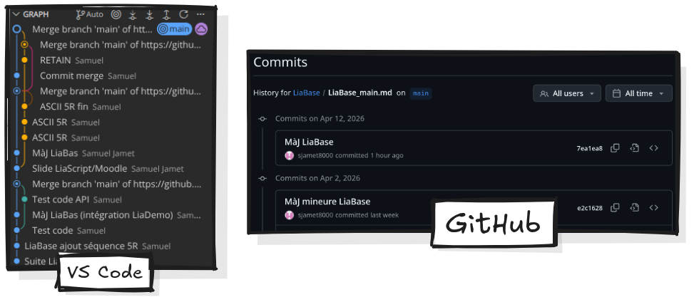

          --{{1}}--
Le suivi des versions implique aussi que votre travail, ou le travail de quelqu'un d'autre qui vous ferait de l'œil est implicitement disponible à la modification et au remixage. sans risque de corruption (on peut toujours revenir à une version antérieure). 

          {{2}}
Le versioning, une invitation au partage et à la collectivisation rigoureuse des moyens de productions pédagogiques.
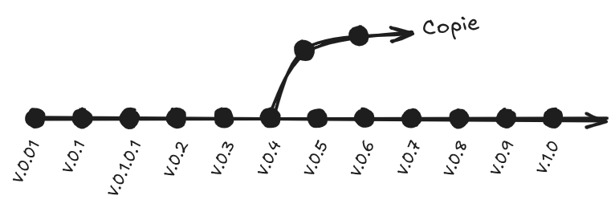

#### ⏱️ 14:00 — 18:00 | REDISTRIBUTE

**Ce que tu fais** :
1. Sur GitHub, tu ouvres le `.md` modifié
2. Tu cliques sur "Raw"
3. Tu copies l'URL raw
4. Tu la colles dans le générateur de lien LiaScript (ou directement dans l'URL LiaScript)
5. Tu montres le cours live, utilisable
6. Tu évoques : "ce lien, je peux le poster n'importe où — mon ENT, un mail, Zenodo pour archivage pérenne avec DOI…"

**Ce que tu dis** :
> *"Dernière étape : je veux partager ma version remixée. Je récupère le lien raw, je le bascule en URL LiaScript, et j'obtiens un cours vivant, accessible à n'importe qui avec juste un navigateur. Ce lien, je peux le poster où je veux : mon ENT, un mail à mes collègues, ou même Zenodo pour obtenir un DOI et un archivage pérenne.*
> 
> ***Ça, c'est le Redistribute.** Et remarquez quelque chose d'important : GitHub, qu'on présente souvent comme un outil de développeur, fonctionne ici comme un **espace de partage et de valorisation** de contenus pédagogiques. Exactement comme HAL ou Zenodo, mais avec en plus la dimension éditable."*

**Plan B** : lien LiaScript déjà généré en amont, prêt à coller si la chaîne casse.

#### ⏱️ 18:00 — 20:00 | Bouclage + transition

**Ce que tu dis** :
> *"Et maintenant, quelqu'un d'autre peut forker mon cours remixé, le réviser à son tour, le re-remixer, le re-redistribuer. **Le cycle des 5R reprend**. C'est ça, une culture REL vivante : pas une ressource figée qu'on télécharge, mais une ressource qui circule et qui s'enrichit.*
> 
> *[Transition vers Souplesse] On vient de voir que vos contenus peuvent circuler librement. Mais encore faut-il que l'outil soit capable de porter ce que vous voulez vraiment enseigner. Passons au deuxième argument : la souplesse."*

**Questions chat** : tu prends 1-2 questions rapides si le timing le permet, sinon tu renvoies à la fin.

### Un outil SOUPLE

### Un outil RESILIENT

## Mise en route

### Se créer un compte GitHub

Pour utiliser tranquillement Liascript, la création d'un compte sur GitHub est nécessaire.

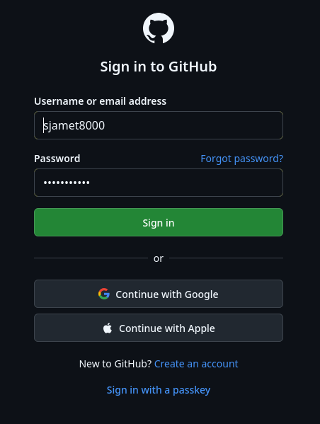

### Créer un répertoire

{{1-3}} Cliquez sur l'icône de votre compte en haut à droit de l'écran, puis sur *Repositories*
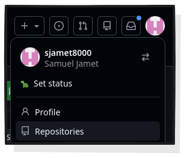

{{2-3}} Cliquez sur *New* pour créer un nouveau répertoire.
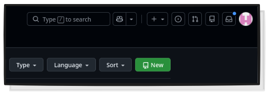

{{3}} Entrez les informations nécessaires. Evitez les espaces dans le nom du répertoire. la description n'est pas obligatoire, mais elle peut aider à ce que l'on retrouve votre répertoire.
Super important : votre répertoire doit impérativement être **public** pour que Liascript puisse l'interpréter.
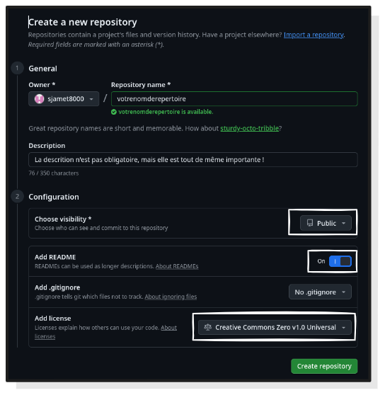

{{4}} Une fois votre répertoire créé, vous pouvez y accéder depuis *Repositories* en cliquant sur l'icone de votre profil. Notez qu'au moment de la création du répertoire, il ne contient rien que la **LICENCE** et le README.md.
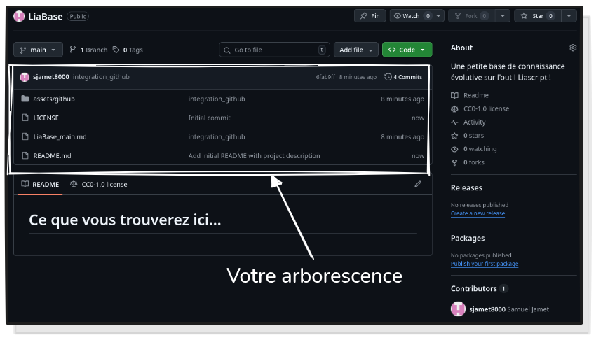

### Visual Studio Code

**Visual Studio Code** est un éditeur de texte gratuit et open source maintenu par **Microsoft** (eh oui, snif). Très utilisé par les développeur.ses, on va plutôt l'utiliser comme simple éditeur de MarkDown, un peu amélioré par le créateur de Liascript, grâce à quelques plug in.
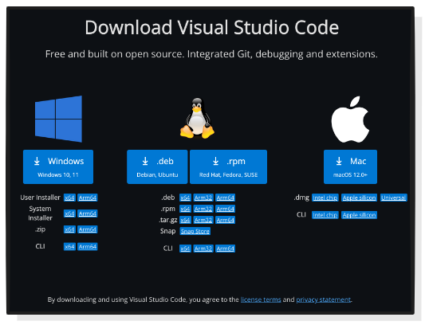

Rendez-vous sur la [page de téléchargement](https://code.visualstudio.com/Download) et procédez à l'installation du logiciel, on se retrouve de l'autre côté.

#### Installer et activer les plugins Liascript

Pour utiliser confortablement Liascript, on va devoir installer deux extensions développées par André Dietrich.
Rendez-vous dans le magasin d'extensions (cf. capture ci-dessous ou `Ctrl + Shift + X`).

Entrez `liascript` dans la barre de recherche, normalement trois extensions doivent remonter. Cliquez sur `LiaScript-Preview` puis sur `Install`.
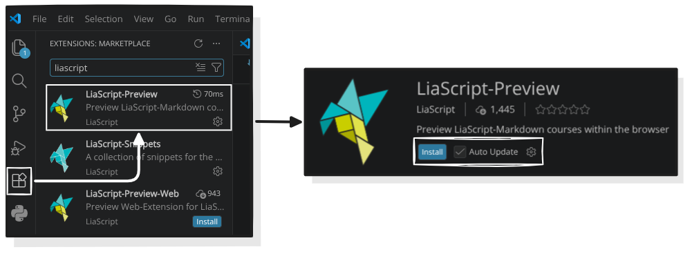

Ce plug in va vous permettre de lancer une prévisualisation de ce que vous êtes en train de produire depuis Visual Code, sur votre navigateur favori, en local, sans connexion internet. Plutôt utile pour vérifier et tester votre cours au fil de l'eau !

##### Installer et activer le plugin Liascript Snippets

Le second plug in se nomme **LiaScript-Snippets**, il n'est pas absolument nécessaire à l'utilisation de LiaScript avec VS Code, mais c'est une aide non négligable quand on débute.

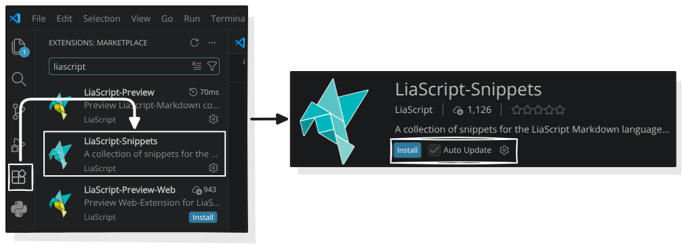

Une fois l'installation faite, ce n'est pas terminé. Sur la page de **LiaScript-Snippets**, on vous demande de copier-coller un morceau de code. Sélectionnez le morceau de code mis en exergue, puis `Ctrl + C`.

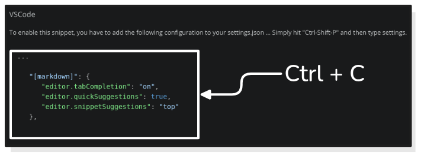

Faites `Ctrl + Shift + P` puis entrez `settings` et cliquez sur Open User Settings (JSON), et collez le morceau de code entre les deux accolades (je le remets ci-dessous), puis quittez.

```
   "[markdown]": {
      "editor.tabCompletion": "on",
      "editor.quickSuggestions": true,
      "editor.snippetSuggestions": "top"
   },
```

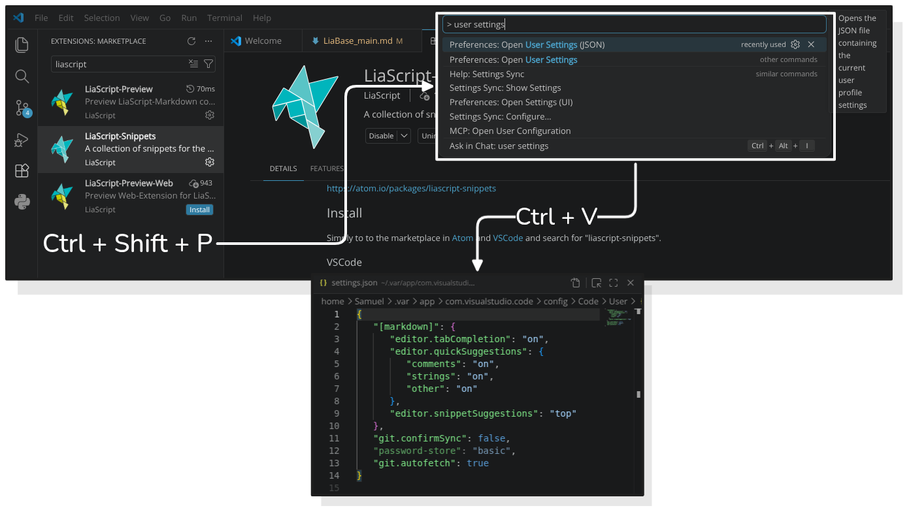

**LiaScript-Snippets** va vous permettre d'"appeler" des fonctionalités de LiaScript comme des modèles mise en formes spécifiques (tableaux, graph, etc.), ou des modèles de quizs, et une miriade de choses super chouettes avec le préfixe `lia`.

### Git

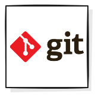Git est un logiciel de gestion de versions décentralisé développé par Linus Torvalds, le créateur du noyeau Linux. Pour en savoir plus sur Git et son fonctionnement, vous pouvez consulter [la page Wikipédia](https://fr.wikipedia.org/wiki/Git) qui est bien détaillée.

#### Installer Git

Aller sur le [site officiel](https://git-scm.com/install/windows) et de télécharger Git for Windows.

Sélectionnez l'installateur `Git for Windows/x64 Setup` qui devrait fonctionner dans la plupart des cas.
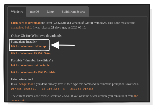

L'installateur de Git sous Windows a beaucoup d'étapes avec plein de cases à cocher, **laisser toutes les options par défaut et de cliquer sur "Next" jusqu'au bout**. Ça ira très bien pour 99 % des usages.

#### Configurer Git

Une fois installé, ouvrez le terminal de commande **Git Bash**.


Vérifiez que Git est bien installé en entrant :

```
git --version
```

Si le terminal vous renvoie `git version 2.5x.x.windows` c'est bon.


C'est là qu'il faut définir l'identité, pour que Git sache qui fait les modifications. 
Voici les commandes à entrer (le --global est important pour que ça s'applique à tous vos futurs projets) :

Pour le nom (avec les guillemets) :

```
git config --global user.name "Prénom Nom"
```

Pour l'email (idéalement celui que vous utilisez pour GitHub) :

```
git config --global user.email "votre.email@exemple.com"
```

Aujourd'hui, le standard est d'appeler la branche principale main (au lieu de l'ancien master). Autant configurer ça tout de suite pour éviter des confusions plus tard :

```
git config --global init.defaultBranch main
```

Pour vérifier que tout a bien fonctionné, taper :

```
git config --list
```

Cela affichera votre nom, votre mail et vos réglages. Si vous voyez vos infos, c'est tout bon !

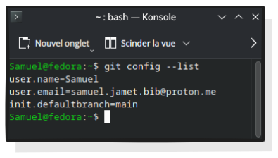

### Cloner votre répertoire GitHub en local

Rendez-vous dans le dossier dans lequel vous souhaitez synchroniser votre répertoire.

A titre personnel, je clone mes répertoires directement dans le dossier Documents, mais vous pouvez choisir un autre dossier.

Une fois dans le dossier, faites un `clic droit` à l'intérieur puis cliquez sur `Open Git Bash here` pour ouvrir le terminal.


Tapez :

```
git clone https://github.com/nomdevotrecompte/nomdurepertoire.git
```


Vous trouverez l'URL du répertoire en vous rendant... dans votre répertoire bien joué, et en cliquant sur `<> code`.

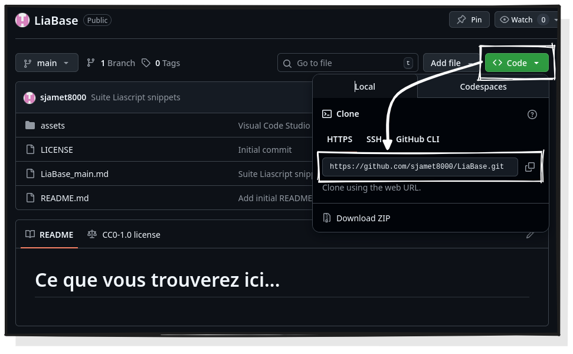

Et voilà ! Votre répertoire avec tout son contenu est cloné sur votre PC ! Si c'est votre premier répertoire, seul le `README.md`et la `LICENCE` ont été clonées, mais ce n'est qu'un début.


### Finalisation de la configuration... et premier commit

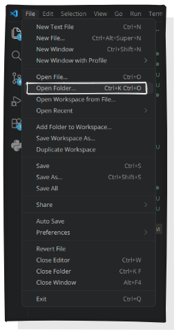Rouvrez VS Code et ouvrez votre répertoire synchronisé : `File > Open Folder... > "Nom du répertoire > Select folder"` (Sélectionnez simplement le répertoire cloné, ne double-cliquez pas dessus)

Votre arborescence s'affichera sur la partie gauche de la fenêtre de VS Code. Sauf événement cataclismique, elle sera parfaitement identique à celle que vous avez dans l'explorateur de fichiers Windows et votre répertoire dans GitHub.

Sélectionnez le `README.md` pour afficher l'éditeur de texte et voyez ce que ça donne. C'est visuellement beaucoup plus sobre et plus du tout WYSIWYG, mais on s'y fait.


#### Créer votre premier document

Evidemment, vous n'allez pas vous mettre à composer dans le `README.md` (conservez ce fichier pour expliquer comment utiliser votre ressource !)

Dans l'arborescence de votre répertoire, toujours dans VS Code, cliquez sur l'icône `New File`juste à côté du nom de votre répertoire.

 Attention, comme vous le voyez sur la capture, il est indispensable de spécifier le format du fichier nouvellement créé, et ce format, c'est du `.md` donc le format MarkDown. Vous pouvez nommer votre document comme vous le souhaitez, mais ajoutez `.md` à la fin si vous voulez que ça fonctionne.

Cliquez sur le document pour afficher l'éditeur de texte. Par défaut, il vous propose de générer du code, mais vous ne mangez pas de ce pain-là. Positionnez-vous dans l'éditeur comme vous le feriez pour un éditeur de texte classique et tapez :

```
lia-init
```

Vous vous souvenez du plug in [LiaScript Snippets](#7) ? C'est là qu'il entre en action. Appuyez sur `entrée` pour faire apparaître une première base du cours à partir de laquelle vous allez pouvoir avancer, ainsi qu'un certain nombre de métadonnées super utiles.


#### Lier VS Code à GitHub

Il est temps de vous mettre au travail, vous avez cloné votre répertoire GitHub, vous allez maintenant l'alimenter et le mettre à jour. Pour cela, vous aller lier VS Code à votre compte GitHub (il existe d'autres voies pour synchroniser vos répertoires, ils seront détaillés dans des versions ultérieures de ce guide).

En bas à gauche de la fenêtre de VS Code, cliquez sur `Accounts`puis sur `Backups and Sync Settings`.


Les `Settings Sync`s'ouvrent en haut de la fenêtre (oui on voyage), cliquez sur `Sign in` puis sur `Sign in with GitHub`


 VS Code va automatiquement ouvrir une page de votre navigateur enregistré par défaut pour vous demander si vous souhaitez vous connecter à GitHub, cliquez sur `Sign in` puis continuez. Si, de retour sur VS Code, le nom de votre compte s'affiche quand vous cliquez sur `Accounts` c'est bon !

#### Premier commit

Vous avez créé votre premier document et vous souhaitez qu'ils soit synchronisé sur votre répertoire GitHub, vous allez donc faire ce qu'on appelle un *commit*, c'est-à-dire une modification du répertoire qui sera décrite et signée de votre nom.

Cliquez sur `Source Control`(par défaut, parmi les quelques icônes sur le côté gauche de la fenêtre de VS Code)


        --{{1}}--
Vous arrivez dans le panneau de contrôle des sources. Juste en dessous du bouton `Commit` un certain nombre de `Changes` sont listés (notamment la création de votre nouveau document.) Cliquez sur le petit `+` en face de `Changes` les éléments listés deviennent des `Staged Changes`prêts à être envoyé dans votre répertoire GitHub. N'oubliez pas de décrire votre modification/ajout avant de cliquer sur `Commit` puis de cliquer sur `Sync Changes` pour que votre répertoire GitHub soit synchronisé.

## Les bases des bases : écrire du texte

        --{{1}}--
Si vous n'êtes pas familier avec le MarkDown, cette section est là pour y remedier. Pas d'inquiétude, les bases du langage sont très simples et vous aurez vite fait le tour du principal de sa syntaxe.
Le plus difficile reste de se défaire de l'accoutumance des éditeurs de texte WYSIWYG (What You See Is What You Get) comme Word.

Ici, 
```markdown
What you see may not be very pleasant...
```
... mais au moins, ça ne se casse pas.

### 1. Structurer votre contenu

        --{{0}}--
Sur LiaScript, une habitude à prendre, c'est de structurer votre contenu (quel qu'il soit). Entrez `#`[^1] suivi d'un texte pour créer la page de titre de votre cours, puis structurez de la manière suivante :

```markdown
# Titre principal de votre cours

 ...

## Titre de la première section

 ...

### Titre d'une sous-section

 ...
## Titre de la deuxième section
```
        --{{1}}--
Vous verrez votre table des matières cliquable se structurer sans que vous ayez besoin de faire quoi que ce soit d'autre chaque section, sous-section devient une page du cours.

Il est aussi possible de créer des sous-sections à l'intérieur d'une page de cours

```markdown
## Titre d'une section

Sous-section dans la page
================

Sous-sous-section dans la même page
--------------------
```

[^1]: `Alt GR + 3` mais vous saviez.

### 2. Mettre en forme votre contenu

        --{{0}}--
En MarkDown, la mise en forme du texte se fait en entourant ce dernier avec certains caractères que voici :

* `*italique*` -> *italique*<!-- class="notranslate"-->
* `**gras**` -> **gras**<!-- class="notranslate"-->
* `***gras et italique ***` -> ***gras et italique ***<!-- class="notranslate"-->
* `_italique aussi_` -> _italique aussi_<!-- class="notranslate"-->
* `__gras aussi__` -> __gras aussi__<!-- class="notranslate"-->
* `___gras et italique aussi___` -> ___gras et italique aussi___<!-- class="notranslate"-->
* `~barré~` -> ~barré~<!-- class="notranslate"-->

        --{{1}}--
Les mises en forme qui suivent n'existent pas en MarkDown de base :

* `~~souligné~~` -> ~~souligné~~<!-- class="notranslate"--> (attention avec l'éditeur VS Code votre texte apparaîtra ~barré~, mais il sera bien ~~souligné~~ dans LiaScript
* `~~~barré et souligné~~~` -> ~~~barré et souligné~~~<!-- class="notranslate"--> (remarque similaire ici, l'affichage du texte dans VS Code peut être confusionnalisant)
* `^en exposant^` -> ^en exposant^<!-- class="notranslate"--> (comme ça vous allez pouvoir écrire XIX^**e**^ et pas XIX**e**.

## More

Find out what you can even do more with quizzes:

https://liascript.github.io/course/?https://raw.githubusercontent.com/liaScript/docs/master/README.md